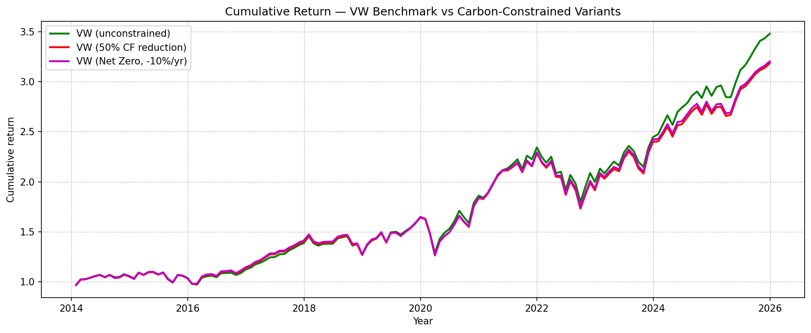

# Cutting the Portfolio Carbon Footprint in Half at 72 Basis Points
## Group AD | North America + Europe | Scope 1 + Scope 2 Emissions
### SAAM Project 2026

---

**The proposition:** a value-weighted portfolio of North American and European equities, constrained to halve its carbon footprint, delivered an annualised return of 10.73% over 2014 to 2025, compared to 11.45% for the unconstrained benchmark. The cost is approximately 72 basis points per year for a 50% reduction in financed emissions. For most institutional mandates subject to EU SFDR, TCFD, or internal net-zero commitments, that cost is defensible.

---

### Performance and carbon results

| Portfolio | Ann. return | Sharpe | Avg. CF (tCO2/m$) | CF vs VW |
|---|---|---|---|---|
| VW Benchmark | 11.45% | 0.680 | 116.2 | — |
| **VW (50% carbon cap)** | **10.73%** | **0.621** | **57.7** | **-50%** |
| VW (Net-Zero path, -10%/yr) | 10.78% | 0.625 | 96.8 | -17% avg |
| MVP (min. variance) | 6.16% | 0.365 | 149.1 | +28% |
| MVP (50% carbon cap) | 5.92% | 0.348 | 74.5 | -36% |

*Out-of-sample, January 2014 to December 2025. CF = carbon footprint in tCO2 per million USD invested.*

*Figure: Cumulative return of the VW benchmark, VW (50% carbon cap), and VW (Net-Zero path). Generated by the notebook.*

---

### Three results that matter for clients

**72 bps for -50% carbon.** The VW(50%) portfolio halves the benchmark carbon footprint at a return cost of 72 basis points per year. Tracking error to the benchmark remains modest because the optimisation explicitly minimises it. This is the proposed strategy for carbon-sensitive mandates.

**Minimum variance is not a carbon strategy.** The unconstrained MVP has a carbon footprint approximately 28% above the VW benchmark (149 vs 116 tCO2/m$) and a weighted-average carbon intensity well above the benchmark (290 vs 168). The MVP concentrates on stocks with stable, low-volatility earnings, which are not systematically low-carbon in this universe. An explicit carbon constraint is the only reliable way to reduce financed emissions.

**Baseline design matters for net-zero ambition.** The VWNZ portfolio, anchored to a 2013 reference level, performed similarly to VW50 in financial terms but achieved a higher average carbon footprint (97 vs 58 tCO2/m$). As the market itself decarbonised over 2014 to 2025, the historically anchored constraint became progressively less restrictive. Investors targeting net zero should anchor their constraint to the current benchmark, not to a fixed historical level.

---

*Group AD | SAAM Project 2026 | Universe: ~800-1,150 AMER+EUR firms | Data: Refinitiv Datastream, 2025 vintage*
